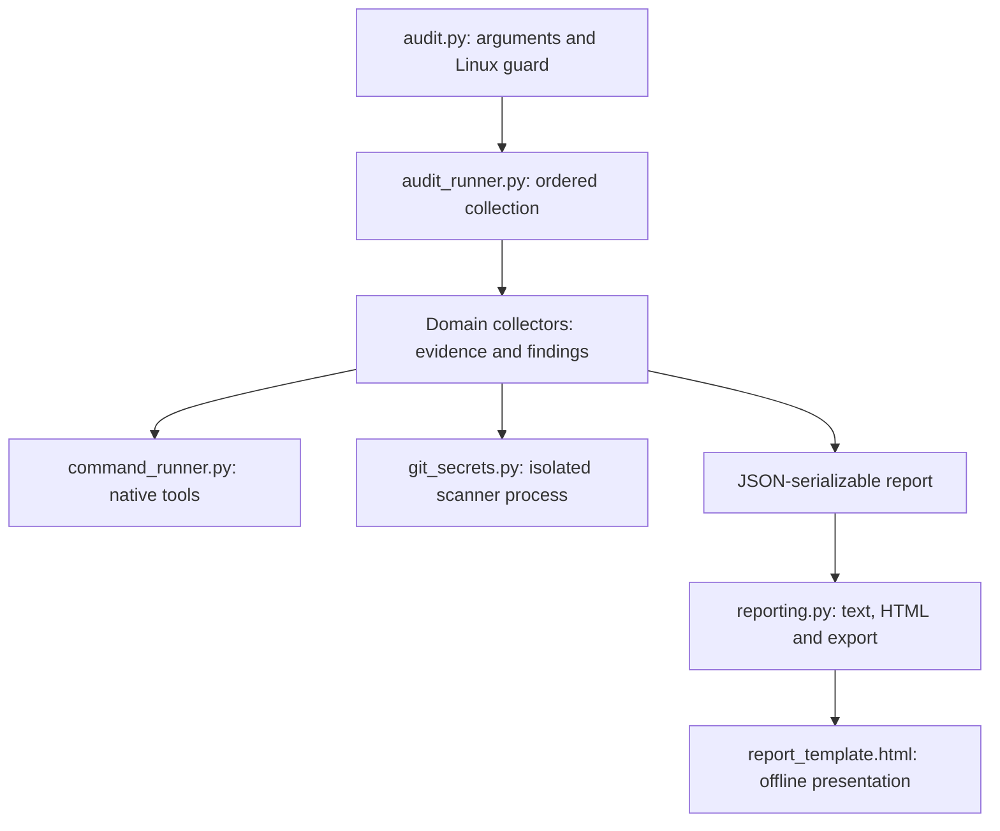

# Architecture and extension guide

[Documentation index](../README.md) · Internal engineering documentation · Reviewed 2026-09-17

Use this guide when changing collection behavior or adding an audit. Keep ownership explicit and preserve the report contract.

## Architecture and extending audits

The host CLI imports audit modules directly. Audits are Python functions, not standalone scripts launched through subprocesses. Subprocesses are reserved for native host tools and Gitleaks. The explicit runner keeps ordering and dependencies visible without a plugin registry, base classes or configuration framework. The external-probe companion is a separate operator-invoked workflow, never a subprocess launched by the host audit.

| Runtime file | Responsibility |
| --- | --- |
| `audit.py` | CLI arguments, platform/PATH setup, output selection and exit codes |
| `audit_runner.py` | Report assembly, collection order, prerequisite data, common failure findings and summary counts |
| `command_runner.py` | Shell-free native tool invocation, locale, timeout and command-result records |
| `ssh_audit.py` | Effective SSH configuration and policy findings |
| `network_audit.py` | Listening sockets, firewall collection and firewall evidence findings |
| `system_audit.py` | OS identity, services, package updates, APT metadata and reboot state |
| `accounts.py` | Account access, authorized keys and login evidence |
| `docker_audit.py` | Allowlisted container metadata and configuration findings |
| `env_files.py` | Environment-file metadata and configured application sources |
| `git_secrets.py` | Opt-in secret scanning, private scratch files, redaction and scanner-specific deadlines |
| `scheduled_tasks.py` | Cron definitions, system timers, permissions and suspicious-pattern review |
| `reporting.py` | Text/HTML rendering and private export bundles |
| `report_template.html` | Offline report layout, themes, filtering and print behavior |
| `external_probe.py` | Separate portable CLI: explicit TCP connect probes and offline import commands |
| `external_verification.py` | Probe schema validation, scope bounds, inventory candidates and conservative import classification |

Each major collector returns `(check, findings)`: a JSON-serializable evidence dictionary plus findings with `level` and `message`. Domain helpers may return a named mapping of related checks where existing report keys require it. Collectors own interpretation and redact sensitive data before returning it; they do not print or export. `reporting.py` only formats collected data and never reruns checks.

The runner invokes SSH before accounts. Environment collection runs after service and Docker collection because `env_files.application_sources` consumes `running_services` and `docker`. Keep these prerequisites explicit; there is no implicit dependency scheduler. Git secret scanning retains its own process runner because it must suppress logs, manage private scanner reports and use different deadlines; forcing it through the normal host-command helper would weaken those guarantees.

To add an audit:

1. Add a focused module with a `collect` function and pure parsing/policy helpers where useful. Accept the command runner as a function argument for native tools.
2. Return evidence and findings, then add one explicit collection call in `audit_runner.py` after any prerequisites. Keep existing check names and JSON fields compatible.
3. Detect prerequisites before launching commands. Use `skipped` with a reason for missing optional tools, and `not_requested` for opt-in checks not selected. Never treat permission denial or an unreachable daemon as absence. Return `error`/`unavailable` for failed collection. The runner emits common UNKNOWN findings except for absent optional Docker/firewall backends. For partial coverage, return `partial` **and an UNKNOWN finding explaining the gap**. `ok` means data was collected, not that security passed; nested failures must remain visible.
4. Add fixture-based tests with injected command responses and temporary files. Avoid requiring root, a daemon or real server data for unit tests. Make native integration tests explicit and optional when a dependency is unavailable.
5. Coverage, raw evidence and limitations appear automatically in HTML. Add a dedicated summary table or text formatting only when it improves readability. Do not add a second source of findings in the renderer.

`test_runner.py` and `fixtures/audit-contract.json` preserve the pre-refactor report data, existing check order and native command order for a representative success/failure fixture. Explicit assertions allow the later optional-tool `skipped` status change without rewriting the original baseline fixture. The separately added scheduled-task check is excluded only from that older baseline comparison and has its own tests. Text-rendering regression tests protect section ordering and prevent raw-output processing from dropping earlier findings. No test relies on a developer's `.artifacts` directory; the optional Gitleaks integration accepts an explicit executable path.

## Data flow

## Design decisions

| Decision | Reason and consequence |
| --- | --- |
| Python standard library and flat modules | No package installation or framework bootstrap. Copy the complete runtime file set together. |
| Explicit sequential runner | Collection order and dependencies are visible. Runtime grows with accounts, containers and tool timeouts; no whole-audit deadline is promised. |
| Inject the command function | Unit tests can supply deterministic tool responses without root or live services. Filesystem tests use temporary paths and patched scope constants. |
| Interpretation belongs to collectors | All output formats share the same findings. Renderers do not decide whether a host is secure. |
| Local collection with explicit scope limits | No remote probing or automatic remediation. Missing evidence remains visible. |
| Separate Gitleaks runner | Scanner output suppression, private scratch files and scanner deadlines are distinct from ordinary host evidence collection. |

## Change boundaries

Preserve check names, output ordering and redaction unless a behavior change is intentional and documented. Extend the responsible collector before adding a new layer. A new collector does not require a plugin registry, base class or standalone subprocess script.

When changing a field or status, update consumers, report tests and [report-format documentation](report-format.md). Do not silently rewrite the historical refactor fixture to make an unrelated regression pass. Add focused assertions for intentional differences. Follow the [development checks](development.md) before handing over changes.

## Decision: external verification as a separate workflow

Status: implemented, 2026-09-17. Local listeners and firewall evidence cannot establish internet reachability. A useful external observation requires a separate source, explicit authorized addresses and recorded scope/time.

The companion reads an existing host report, performs bounded TCP connects only when explicitly invoked, and writes a separate probe document. Offline import validates that document, adds `checks.external_verification` to a copy, and reuses `reporting.export_report`. No host re-audit, scheduler, remote agent or new dependency is required. Classification/correlation belongs to `external_verification.py`; the renderer only presents it.

Alternatives: probing inside the host collector would confuse local/hairpin reachability with external access. Wrapping Nmap would add a dependency and broader scan surface for a TCP-connect-only requirement. Automatic address or application discovery would expand authorization and attribution assumptions. These are not implemented.

Consequences: TCP reachability only, operator-attested location/independence, literal targets, bounded endpoints, and unverified same-port service candidates. UDP, HTTP/TLS and DNS-based application exposure remain separate work. Host identity plus audit timestamp binds imports operationally, not cryptographically. Future stronger provenance requires a concrete integrity requirement.

Verification: focused tests cover localhost sockets, mocked external observations, conservative status derivation, input boundaries and offline import/export. The probe schema has its own version; the host report gains an additive optional check without changing schema version 1. See the [runbook](external-verification.md) and [format contract](report-format.md#external-verification-extension).
