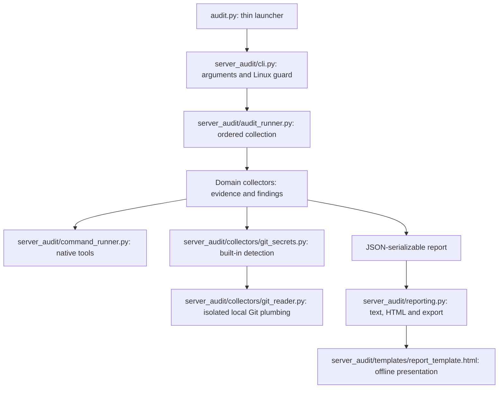

# Architecture and extension guide

[Documentation index](../README.md) · Internal engineering documentation · Reviewed 2026-09-17

Use this guide when changing collection behavior or adding an audit. Keep ownership explicit and preserve the report contract.

## Architecture and extending audits

The root launchers delegate to `server_audit/cli.py` and `server_audit/external_probe.py`. These import the runtime modules directly. Audits are Python functions, not standalone scripts launched through subprocesses. Subprocesses are reserved for the approved native host tools and local Git storage reader. New external-tool integrations require prior explicit user approval under [AGENTS.md](../AGENTS.md#external-tool-approval). The explicit runner keeps ordering and dependencies visible without a plugin registry, base classes or configuration framework. The external-probe companion is a separate operator-invoked workflow, never a subprocess launched by the host audit.

| Runtime file | Responsibility |
| --- | --- |
| `audit.py` | Thin host-audit launcher; delegates to `server_audit.cli.main` |
| `server_audit/cli.py` | CLI arguments, platform/PATH setup, output selection and exit codes |
| `server_audit/audit_runner.py` | Report assembly, collection order, prerequisite data, common failure findings and summary counts |
| `server_audit/command_runner.py` | Shell-free native tool invocation, locale, timeout and command-result records |
| `server_audit/collectors/ssh_audit.py` | Effective SSH configuration and policy findings |
| `server_audit/collectors/network_audit.py` | Listening sockets, firewall collection and firewall evidence findings |
| `server_audit/collectors/system_audit.py` | OS identity, services, package updates, APT metadata and reboot state |
| `server_audit/collectors/accounts.py` | Account access, authorized keys and login evidence |
| `server_audit/collectors/docker_audit.py` | Allowlisted container metadata and configuration findings |
| `server_audit/collectors/env_files.py` | Environment-file metadata and configured application sources |
| `server_audit/collectors/git_secrets.py` | Built-in candidate rules, selected local Git scope, limits and redacted findings |
| `server_audit/collectors/git_reader.py` | Bounded Git plumbing, isolated reader metadata, pipe ownership and cancellation |
| `server_audit/collectors/scheduled_tasks.py` | Cron definitions, system timers, permissions and suspicious-pattern review |
| `server_audit/reporting.py` | Text/HTML rendering and private export bundles |
| `server_audit/templates/report_template.html` | Offline report layout, themes, filtering and print behavior |
| `external_probe.py` | Thin companion launcher; delegates to `server_audit.external_probe.main` |
| `server_audit/external_probe.py` | Separate portable CLI: explicit TCP connect probes and offline import commands |
| `server_audit/external_verification.py` | Probe schema validation, scope bounds, inventory candidates and conservative import classification |

The deployment set is both root launchers and the complete `server_audit/` directory, including its two minimal `__init__.py` files and `templates/report_template.html`. Preserve that directory structure. `tests/`, its fixtures and `docs/` are not runtime dependencies. Exclude caches and actual audit reports. See the [copy-and-run procedure](operations.md#prerequisites-and-installation).

Each major collector returns `(check, findings)`: a JSON-serializable evidence dictionary plus findings with `level` and `message`. Domain helpers may return their mapping interfaces. Collectors own interpretation and redact sensitive data before returning it; they do not print or export. `server_audit/reporting.py` only formats collected data and never reruns checks.

The runner invokes SSH before accounts. Environment collection runs after service and Docker collection because `env_files.application_sources` consumes `running_services` and `docker`. Keep these prerequisites explicit; there is no implicit dependency scheduler. Git secret detection reads secret-bearing bytes through `server_audit/collectors/git_reader.py`, not through the ordinary command-output records. Its narrowly scoped pipe reader bounds data before capture and shares the repository deadline; only detection metadata crosses into the report.

To add an audit:

1. Add a focused module with a `collect` function and pure parsing/policy helpers where useful. Accept the command runner as a function argument for native tools.
2. Return evidence and findings, then add one explicit collection call in `server_audit/audit_runner.py` after any prerequisites. Keep existing check names and JSON fields compatible.
3. Detect prerequisites before launching commands. Use `skipped` with a reason for missing optional tools, and `not_requested` for opt-in checks not selected. Never treat permission denial or an unreachable daemon as absence. Return `error`/`unavailable` for failed collection. The runner emits common UNKNOWN findings except for absent optional Docker/firewall backends. For partial coverage, return `partial` **and an UNKNOWN finding explaining the gap**. `ok` means data was collected, not that security passed; nested failures must remain visible.
4. Add fixture-based tests with injected command responses and temporary files. Avoid requiring root, a daemon or real server data for unit tests. Make native integration tests explicit and optional when a dependency is unavailable.
5. Coverage, raw evidence and limitations appear automatically in HTML. Add a dedicated summary table or text formatting only when it improves readability. Do not add a second source of findings in the renderer.

`tests/test_runner.py` and `tests/fixtures/audit-contract.json` preserve the pre-refactor report data, existing check order and native command order for a representative success/failure fixture. Explicit assertions allow the later optional-tool `skipped` status change without rewriting the original baseline fixture. The separately added scheduled-task check is excluded only from that older baseline comparison and has its own tests. Text-rendering regression tests protect section ordering and prevent raw-output processing from dropping earlier findings. No test relies on a developer's `.artifacts` directory. Native Git tests create disposable local repositories using an already installed Git executable; public endpoints remain mocked.

## Data flow

## Design decisions

| Decision | Reason and consequence |
| --- | --- |
| Python standard library and a shallow runtime package | No package installation or framework bootstrap. Copy both launchers and the complete runtime package together. |
| Explicit sequential runner | Collection order and dependencies are visible. Runtime grows with accounts, containers and tool timeouts; no whole-audit deadline is promised. |
| Inject the command function | Unit tests can supply deterministic tool responses without root or live services. Filesystem tests use temporary paths and patched scope constants. |
| Interpretation belongs to collectors | All output formats share the same findings. Renderers do not decide whether a host is secure. |
| Local collection with explicit scope limits | No remote probing or automatic remediation. Missing evidence remains visible. |
| Built-in Git detection with an approved storage reader | Python owns candidate rules; Git owns object decompression/delta handling. Bounded secret-bearing pipes stay separate from reportable native output. |

## Change boundaries

Preserve check names, output ordering and redaction unless a behavior change is intentional and documented. Extend the responsible collector before adding a new layer. A new collector does not require a plugin registry, base class or standalone subprocess script.

When changing a field or status, update consumers, report tests and [report-format documentation](report-format.md). Do not silently rewrite the historical refactor fixture to make an unrelated regression pass. Add focused assertions for intentional differences. Follow the [development checks](development.md) before handing over changes.

## Decision: external verification as a separate workflow

Status: implemented, 2026-09-17. Local listeners and firewall evidence cannot establish internet reachability. A useful external observation requires a separate source, explicit authorized addresses and recorded scope/time.

The companion reads an existing host report, performs bounded TCP connects only when explicitly invoked, and writes a separate probe document. Offline import validates that document, adds `checks.external_verification` to a copy, and reuses `reporting.export_report`. No host re-audit, scheduler, remote agent or new dependency is required. Classification/correlation belongs to `server_audit/external_verification.py`; the renderer only presents it.

Alternatives: probing inside the host collector would confuse local/hairpin reachability with external access. Wrapping Nmap would add a dependency and broader scan surface for a TCP-connect-only requirement. Automatic address or application discovery would expand authorization and attribution assumptions. These are not implemented.

Consequences: TCP reachability only, operator-attested location/independence, literal targets, bounded endpoints, and unverified same-port service candidates. UDP, HTTP/TLS and DNS-based application exposure remain separate work. Host identity plus audit timestamp binds imports operationally, not cryptographically. Future stronger provenance requires a concrete integrity requirement.

Verification: focused tests cover localhost sockets, mocked external observations, conservative status derivation, input boundaries and offline import/export. The probe schema has its own version; the host report gains an additive optional check without changing schema version 1. See the [runbook](external-verification.md) and [format contract](report-format.md#external-verification-extension).

## Decision: built-in local Git secret inspection

Status: merged in [PR #3](https://github.com/novakin/Server-Audit/pull/3), commit `66e930ef`, on 2026-09-17. Deployment remains a separate decision. The user explicitly approved replacing Gitleaks, retaining local Git only as a storage reader, and a configurable default 60-second repository budget. This supersedes the former Gitleaks runner decision. The approval does not authorize additional scanners or services.

`server_audit/collectors/git_secrets.py` detects fixed candidate patterns in config/config.worktree and locally stored blob, commit and tag content. `server_audit/collectors/git_reader.py` uses native `git config --no-includes --file` only for storage-format keys, and `git cat-file` batch commands for object access. It creates an isolated bare reader view containing generated metadata only. Source-repository policy, hooks, filters, alternates and config includes are not executed or followed. The child environment is allowlisted, protocols are disabled, and lazy fetching/replacement objects are disabled. Standard and bare SHA-1/SHA-256 object stores are exercised by tests.

Alternatives: retaining Gitleaks would contradict the approved requirement. Text-searching raw `.git` files misses compressed and delta objects. A Python packfile parser would add storage-format maintenance unrelated to detection; it was not selected. Current working-file scanning and original filename/commit reconstruction are deliberately outside this change.

The two persistent object-reader processes share the repository deadline and expose bounded headers/content. Sizes are checked before requesting content. Enumeration, storage traversal, bytes and detections are capped; already found evidence survives incomplete reads. Git's internal memory use is not a Python capture limit, and a repository being modified concurrently is not an atomic snapshot. Fatal or interrupted shutdown retains generated reader metadata and prevents final audit export, rather than converting cancellation into a clean result.

Compatibility: `checks.git_secrets`, repository/scans containers and existing detection keys remain. The detector is explicitly identified as `builtin` with a ruleset version. New scan modes identify configuration and stored objects; no working-directory scan is claimed. Old reports still render. See [evidence contract](report-format.md#built-in-git-secret-evidence), [scope](audit-reference.md#git-secrets), and [verification](development.md#built-in-local-git-inspection--2026-09-17).

Native interfaces: [Git cat-file](https://git-scm.com/docs/git-cat-file), [Git configuration](https://git-scm.com/docs/git-config), and [Git environment controls](https://git-scm.com/docs/git). These interfaces read storage; they do not provide the detector's rules or certify coverage.

## Decision: runtime package and test layout

Status: approved and implemented on the reorganisation branch, 2026-09-17; merge and deployment remain separate. The root mixed runtime code, test modules and presentation assets. The user approved separating them without changing audit behaviour or introducing dependencies.

Runtime lives in `server_audit/`; `collectors/` holds checks and their focused helpers, and `templates/` holds the offline template. The root `audit.py` and `external_probe.py` only import and call their respective `main` functions. Package initializers have no eager imports. Tests live in the ordinary `tests` package; shared host fixtures moved to `tests/helpers.py` and the historical JSON moved unchanged to `tests/fixtures/audit-contract.json`.

Keep the package beside the launchers, not under `src/`: the approved operating model is copy-and-run, without installation, `PYTHONPATH` or `sys.path` workarounds. Do not introduce forwarding modules for old internal imports, generic `utils` layers, automatic collector discovery or new packaging infrastructure. Collector names and explicit execution order stay unchanged.

Compatibility: public launch filenames, CLI options/exit codes, caller-relative paths, detection and report schemas remain unchanged. Internal imports intentionally move to `server_audit.*`; they are not a compatibility API. Use `from server_audit import audit_runner, reporting` and `from server_audit.collectors import git_secrets` in internal consumers. Run targeted tests as `python3 -m unittest tests.test_git_secrets -v` and discovery with `-s tests -t .`. Resources resolve from `__file__`, never by changing the caller's directory.

Verification: compare the complete test inventory and skip gates, deterministic JSON/text/HTML and CLI help against the pre-move baseline. `tests/test_layout.py` checks a runtime-only copy, launch delegation/exit codes, both launchers and companion subcommands from another directory, template availability, relative paths, no-network companion operations and initializer isolation. See the [verification record](development.md#package-layout-verification--2026-09-17).
